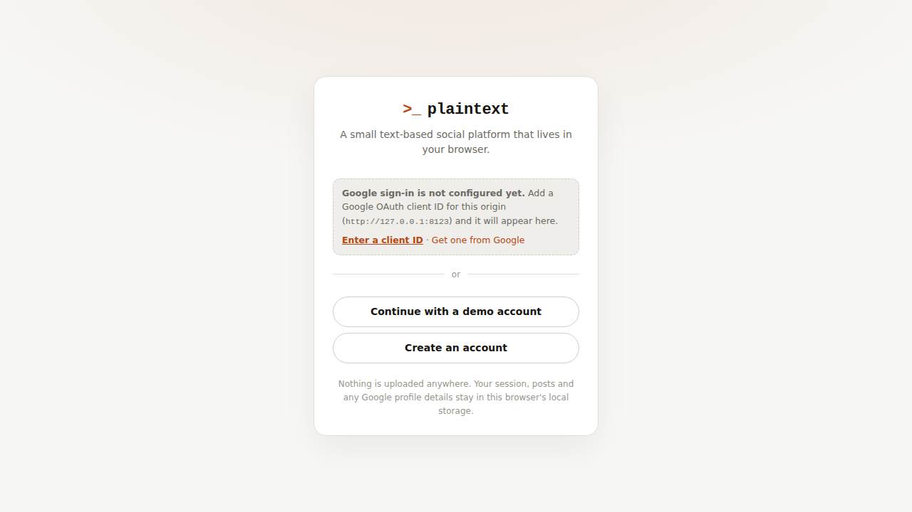

# plaintext

A small, functional text-based social platform that runs entirely in the browser.
No build step, no server, no accounts — open `index.html` and it works.


## Run it

```sh
python3 -m http.server 8000
# then visit http://localhost:8000
```

Opening `index.html` directly works too, but Google sign-in does not — Google
rejects `file://` origins — so serve it over http if you want the Google button.

## Sign in with Google



The app opens on a sign-in screen. Google sign-in uses
[Google Identity Services](https://developers.google.com/identity/gsi/web) and
needs an OAuth client ID of your own:

1. Go to
   [Google Cloud → Credentials](https://console.cloud.google.com/apis/credentials)
   → **Create credentials** → **OAuth client ID** → **Web application**.
2. Under **Authorized JavaScript origins**, add the origin you serve from —
   e.g. `http://localhost:8000`. This must match exactly, port included.
3. Give the app the client ID, either way:
   - paste it into `GOOGLE_CLIENT_ID` in `js/config.js`, or
   - click **Enter a client ID** on the sign-in screen (stored in this browser
     only, under `plaintext.googleClientId`).

The Google button then appears on the sign-in screen. Signing in creates a
plaintext account linked to your Google account id, using your Google display
name and profile picture; signing in again later reuses that same account
rather than making a new one. Sign out from Settings or the account switcher.

No client ID, or offline? The screen says so and you can still continue with a
demo account or create a local one — everything else works the same.

### What this is not

There is no backend, so the Google ID token is decoded **in the browser** to
read your name, email and picture. The app checks the token's audience, issuer
and expiry, but it cannot verify the signature — that requires a server. Treat
the session as a convenience for this browser, not a security boundary: all data
here is local to your browser anyway, and nothing is uploaded. If you ever put
this behind real data, verify the ID token server-side (Google's
`tokeninfo` endpoint or a library) before trusting it.

## What works

**Posting** — 280-character posts with a live counter, ⌘/Ctrl+Enter to send,
`#hashtags`, `@mentions` and URLs auto-linked, delete your own posts.

**Timelines** — *Following* and *Everything* tabs, reposts surfaced with a
"X reposted" context line and collapsed to one entry per post.

**Threads** — click any post for the full thread: ancestors above, an inline
reply box, replies below. Reply counts update everywhere.

**Reactions** — like, repost, and bookmark, each with counts and toggled state.

**People** — profiles with bio, join date, follower/following lists, and
Posts / Replies / Likes tabs. Follow and unfollow anyone. Edit your own profile.

**Notifications** — likes, reposts, replies, mentions and follows, with an
unread badge in the sidebar and a Mentions & replies filter.

**Search & explore** — full-text search over posts, people search, hashtag
pages, trending tags, most-engaged posts, and who-to-follow suggestions.

**Accounts** — sign in with Google, pick one of eight seeded demo accounts, or
create a local one; switch between them and sign out at any time. New accounts
start following a few people so the first timeline isn't empty.

**The rest** — light/dark theme, responsive down to phone width, keyboard
shortcuts, and a Settings page with export and reset.

### Keyboard shortcuts

| Key | Action |
| --- | --- |
| `n` | New post |
| `/` | Focus search |
| `t` | Toggle theme |
| `g` then `h` / `e` / `n` / `b` / `p` | Home / Explore / Notifications / Bookmarks / Profile |
| `Esc` | Close dialog |
| `⌘`/`Ctrl` + `Enter` | Send the post you're writing |

## How it's built

Plain HTML, CSS and JavaScript — no framework, no dependencies.

```
index.html      markup shell: sign-in gate, rail, timeline column, sidebar
styles.css      design tokens, light/dark themes, responsive layout
js/config.js    deployment settings (your Google OAuth client ID)
js/auth.js      Google Identity Services: script loading, ID token decoding
js/store.js     state, persistence, timelines, and every mutation
js/seed.js      the starting world — accounts, posts, threads, history
js/ui.js        DOM helpers and reusable pieces (post card, composer, rows)
js/app.js       hash router, views, keyboard, and app wiring
```

Sessions are just a `currentUserId` on that state, so signing out is dropping
the id and signing in is setting it. State lives in a single object in `store.js`, is written to `localStorage`
under `plaintext.state.v1` after every mutation, and views re-render from a
subscription. Nothing leaves your browser — Settings → Reset restores the
seeded world.

Simulated activity is on by default: after you post, a couple of other accounts
like or reply to it a few seconds later, so notifications have something real in
them. Turn it off in Settings.
