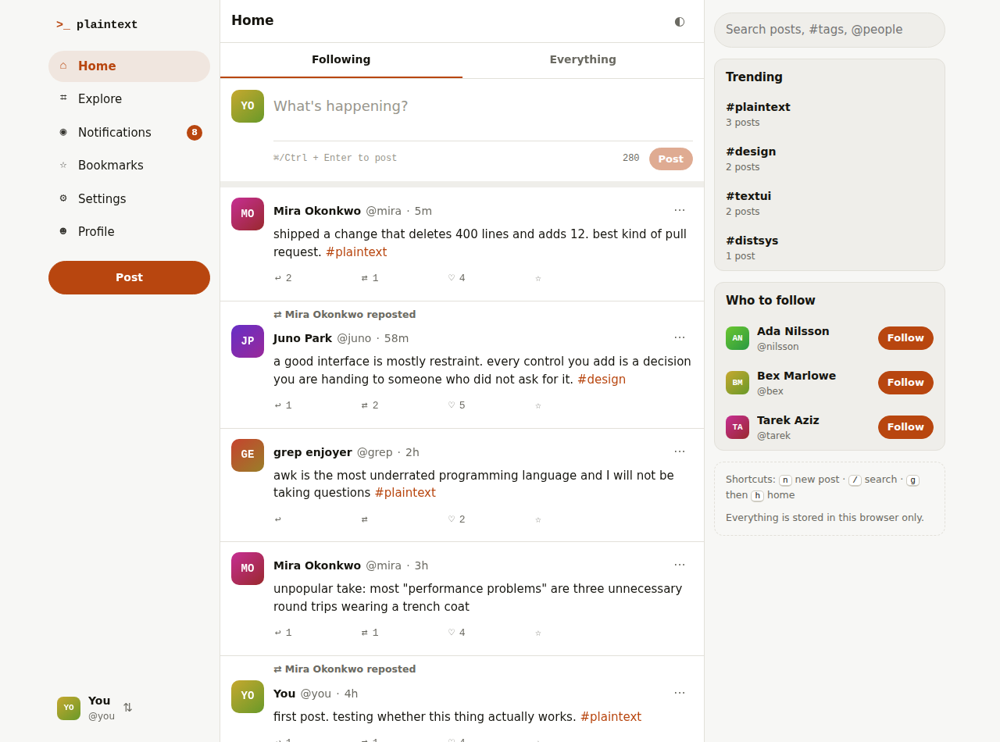

# plaintext

A small, functional text-based social platform that runs entirely in the browser.
No build step, no server, no accounts — open `index.html` and it works.



## Run it

```sh
# simplest
open index.html          # macOS  (or: xdg-open index.html)

# or serve it, if your browser restricts localStorage on file:// URLs
python3 -m http.server 8000
# then visit http://localhost:8000
```

## What works

**Posting** — 280-character posts with a live counter, ⌘/Ctrl+Enter to send,
`#hashtags`, `@mentions` and URLs auto-linked, delete your own posts.

**Timelines** — *Following* and *Everything* tabs, reposts surfaced with a
"X reposted" context line and collapsed to one entry per post.

**Threads** — click any post for the full thread: ancestors above, an inline
reply box, replies below. Reply counts update everywhere.

**Reactions** — like, repost, and bookmark, each with counts and toggled state.

**People** — profiles with bio, join date, follower/following lists, and
Posts / Replies / Likes tabs. Follow and unfollow anyone. Edit your own profile.

**Notifications** — likes, reposts, replies, mentions and follows, with an
unread badge in the sidebar and a Mentions & replies filter.

**Search & explore** — full-text search over posts, people search, hashtag
pages, trending tags, most-engaged posts, and who-to-follow suggestions.

**Accounts** — eight seeded accounts you can switch between (so the world has
real replies and followers), plus creating your own.

**The rest** — light/dark theme, responsive down to phone width, keyboard
shortcuts, and a Settings page with export and reset.

### Keyboard shortcuts

| Key | Action |
| --- | --- |
| `n` | New post |
| `/` | Focus search |
| `t` | Toggle theme |
| `g` then `h` / `e` / `n` / `b` / `p` | Home / Explore / Notifications / Bookmarks / Profile |
| `Esc` | Close dialog |
| `⌘`/`Ctrl` + `Enter` | Send the post you're writing |

## How it's built

Plain HTML, CSS and JavaScript — no framework, no dependencies.

```
index.html      markup shell: rail, timeline column, sidebar
styles.css      design tokens, light/dark themes, responsive layout
js/store.js     state, persistence, timelines, and every mutation
js/seed.js      the starting world — accounts, posts, threads, history
js/ui.js        DOM helpers and reusable pieces (post card, composer, rows)
js/app.js       hash router, views, keyboard, and app wiring
```

State lives in a single object in `store.js`, is written to `localStorage`
under `plaintext.state.v1` after every mutation, and views re-render from a
subscription. Nothing leaves your browser — Settings → Reset restores the
seeded world.

Simulated activity is on by default: after you post, a couple of other accounts
like or reply to it a few seconds later, so notifications have something real in
them. Turn it off in Settings.
